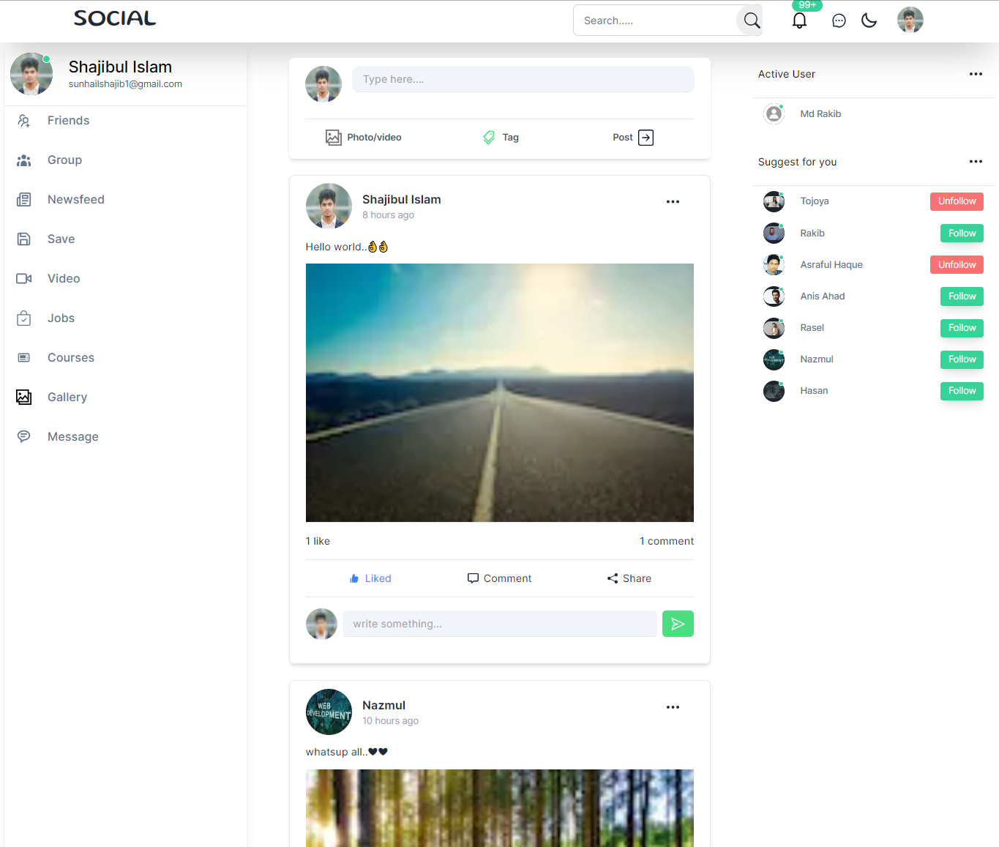

# DevSocial



DevSocial is a professional and feature-rich social networking platform built using the MERN stack. This repository contains both the client-side and server-side code for the application.

## Table of Contents

- [Technologies Used](#technologies-used)
- [Features](#features)
- [Live Demo](#live-demo)
- [Contact](#contact)
- [Getting Started](#getting-started)
  - [Prerequisites](#prerequisites)
  - [Installation](#installation)
  - [Running the Project](#running-the-project)
- [Instructions for Use](#instructions-for-use)

## Technologies Used

### Frontend

- [Next.js 13](https://nextjs.org/)
- [Tailwind CSS](https://tailwindcss.com/)
- [DaisyUI](https://daisyui.com/)
- [Redux Toolkit Query](https://redux-toolkit.js.org/query/overview)
- [React Icons](https://react-icons.github.io/react-icons/)
- [React Spinners](https://github.com/davidhu2000/react-spinners)
- [React Toastify](https://fkhadra.github.io/react-toastify/introduction)

### Backend

- Node.js
- Express
- MongoDB
- Cloudinary (for image storage)
- Bcrypt (for password hashing)
- Cookie-parser
- Colors
- Dotenv
- CORS
- JSON Web Token (JWT)
- Mongoose
- Multer (for file uploads)
- Nodemailer (for email functionality)
- Nodemon (for server development)

## Features

- User authentication (login, register, logout)
- Password reset via email
- Email verification
- Dark mode support
- Responsive design
- Create, read, update, and delete posts
- Like and comment on posts
- Update user profile and cover image
- Follower/following functionality
- Single friend page with Friend list
- User profile page

## Live Demo

### You can access the live demo of DevSocial at

- [Live_Link](https://my-dev-social.vercel.app/).

- [Video_link](https://www.linkedin.com/posts/developer-shajib_uses-features-activity-7105382804879790080-v3Oj?utm_source=share&utm_medium=member_desktop)

## Contact

- [LinkedIn](https://www.linkedin.com/in/developer-shajib/)
- Email: [sunhailshajib1@gmail.com](mailto:sunhailshajib1@gmail.com)
- Portfolio: [developershajib](https://developershajib.vercel.app/)

## Getting Started

### Prerequisites

Before running the project, ensure you have the following installed:

- Node.js and npm
- MongoDB
- Cloudinary account (for image storage)
- Your favorite code editor

### Installation

1. Clone this repository to your local machine:

   ```bash
   git clone https://github.com/developer-shajib/DevSocial.git
   ```

2. Install server dependencies:

   ```bash
   cd server
   npm install
   ```

3. Create a `.env` file in the `server` directory and set the following environment variables:

   ```env

    PORT = 5050
    APP_ENV = Development
    BASE_URL = http://localhost:3000
    MONGODB_URI =
    ACCESS_TOKEN =
    ATOKEN_EXPIRE =
    COOKIE_EXPIRE =

    #for_cloudinary
    CLOUD_NAME =
    API_KEY =
    API_SECRET =

    #email_send
    USER_EMAIL =
    APP_PASS =
    EMAIL_HOST =
    Email_Port =
    EMAIL_VERIFY_TOKEN_SECRET =
    VERIFY_TOKEN_EXPIRE_IN =
   ```

4. Return to the project root directory:

   ```bash
   cd ..
   ```

5. Install client dependencies:

   ```bash
   cd client
   npm install
   ```

6. Create a `.env.local` file in the `client` directory and set the following environment variables:

   ```env
    NEXT_PUBLIC_SERVER_URL = http://localhost:5050
   ```

### Running the Project

1. Start the server:

   ```bash
   cd server
   npm start
   ```

2. Start the client:

   ```bash
   cd client
   npm run dev
   ```

3. Access the application in your web browser at `http://localhost:3000`.

## Instructions for Use

Please refer to the project's code for detailed comments and explanations. If you have any questions or encounter issues, feel free to contact us via the provided contact information.

Enjoy using DevSocial! 🚀
